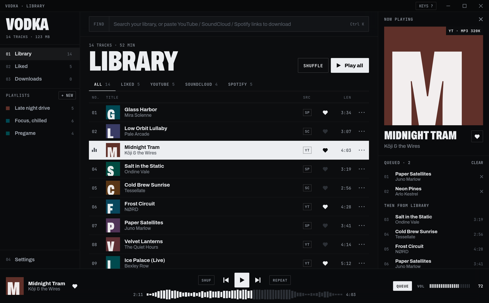

# Vodka

A desktop music player you fill yourself. Paste a YouTube, SoundCloud or Spotify link, Vodka downloads the audio into a local library, and from there you play it, like it, queue it and sort it into playlists. No accounts, no streaming, just files on your disk.



## Features

- **Paste anything, anywhere.** Paste links into the search bar, anywhere in the window, or drag and drop them in. Several links at once work, and so do playlist and album links (each track becomes its own download).
- **Spotify without an account.** Spotify tracks are matched to the same song on YouTube, then tagged with Spotify's title, artist and cover art.
- **Download queue.** Parallel downloads with live progress, pause and resume, cancel, retry, and duplicate skipping.
- **Proper files.** MP3, M4A, Opus or FLAC at the bitrate you pick, with metadata and cover art embedded, so they work in any other player too.
- **Synced lyrics that fit your file.** Lyrics follow the song line by line, from [LRCLIB](https://lrclib.net). Because a YouTube upload is often a different edit than the album version the lyrics were timed for, Vodka listens to each song locally with [whisper.cpp](https://github.com/ggml-org/whisper.cpp) and moves every line to where it is actually sung. Click any line to jump there.
- **Speed.** Play anything from 1.0× up to 2.5×, keeping the pitch or letting it rise for the sped-up sound.
- **Player.** Waveform seek bar, shuffle, repeat off / all / one, crossfade, volume normalization, and a queue that shows exactly what plays next.
- **Library.** Search, filter by source, sort, like tracks and build playlists. Deletes can be undone.
- **Keyboard first.** Every main action has a shortcut (press `?` in the app).
- **Stays out of the way.** Closes to the tray and keeps playing. Works in a narrow window, and answers media keys where your desktop supports it.

## Getting started

### 1. Install the prerequisites

- [Node.js](https://nodejs.org) 20 or newer
- [Rust](https://rustup.rs) (stable)
- ffmpeg (`ffmpeg` and `ffprobe` on your `PATH`)
- git, CMake and a C++ compiler (to build whisper.cpp for lyrics sync)
- The [Tauri system dependencies](https://v2.tauri.app/start/prerequisites/) for your OS

On Linux you also need GStreamer codecs for playback, and the app indicator library for the tray icon:

```sh
# Arch
sudo pacman -S webkit2gtk-4.1 libayatana-appindicator gst-plugins-good gst-libav ffmpeg cmake base-devel

# Debian / Ubuntu
sudo apt install libwebkit2gtk-4.1-dev libayatana-appindicator3-dev \
  gstreamer1.0-plugins-good gstreamer1.0-libav ffmpeg cmake build-essential
```

### 2. Get the code and its helper tools

```sh
git clone https://github.com/zOrpheas/vodka.git
cd vodka
npm install
npm run sidecars   # downloads yt-dlp, copies ffmpeg/ffprobe, builds whisper-cli (a minute or two)
```

`npm run sidecars` uses a POSIX shell. On Windows, run it from Git Bash or WSL.

### 3. Run it

```sh
npm run tauri dev
```

The first run compiles the Rust side, which takes a few minutes. After that it starts in seconds.

### 4. Install it (Linux)

```sh
sh scripts/install-linux.sh
```

This builds a release version and installs it for your user in `~/.local/share/vodka`, with an entry in your app launcher. No root needed. Run it again to update, or remove it with `sh scripts/install-linux.sh --uninstall` (your library and music stay).

To build an installer package for your platform instead:

```sh
npm run tauri build
```

The output lands in `src-tauri/target/release/bundle/`.

## Using Vodka

1. Copy a link from YouTube, SoundCloud or Spotify.
2. Paste it into Vodka. The bar switches from **FIND** to **POUR**; press Enter.
3. Watch it in **Downloads**. When it's done it appears at the top of your **Library**.
4. Click a track to play it. Right-click it (or use `···`) to queue it, like it or add it to a playlist.

Typing plain text in the bar searches your library instead.

### Lyrics

Press **LYRICS** in the player bar (or `Y`). The current line lights up as the song plays and the view scrolls with it; click a line to jump to that moment. If you scroll to read ahead, it waits a few seconds before following the song again.

The first time a song with synced lyrics plays, Vodka matches the lyrics to your file: it transcribes the song on your computer (nothing is uploaded), finds where each line is sung, and re-times the lines. This takes around 10 to 30 seconds in the background, and the lyrics header shows *matching to your file* while it works and *matched to your file* when done. Lines from parts of the song your version doesn't have (a cut intro, a shorter outro) are left out. The very first time, Vodka downloads the 148 MB speech model it needs.

Vodka also keeps the lyrics in step with what you actually hear. Some systems play audio slightly later than the player reports, so Vodka measures that delay automatically each time a track starts and corrects for it. If the words still feel a touch early or late, fine-tune with **EARLIER** / **LATER** at the top of the lyrics. The adjustment is remembered. When no lyrics are found, **SEARCH AGAIN** looks again. LRCLIB grows every day.

### Keyboard shortcuts

| Action | Key |
|---|---|
| Play / pause | `Space` |
| Search or paste | `Ctrl K` (`⌘K` on macOS) |
| Next / previous track | `Shift →` / `Shift ←` |
| Seek 5 seconds | `←` / `→` |
| Volume | `↑` / `↓` |
| Like the current track | `L` |
| Now playing panel | `Q` |
| Shuffle / repeat | `S` / `R` |
| Mute | `M` |
| Lyrics | `Y` |
| Speed down / up (0.1×) | `[` / `]` |
| Show all shortcuts | `?` |
| Close menus, clear search | `Esc` |

### Settings

| Setting | What it does |
|---|---|
| Save to | Folder new downloads go to (default `~/Music/Vodka`) |
| Format / Bitrate | MP3, M4A, Opus or FLAC (lossless), 128 to 320 kbps |
| Parallel downloads | 1 to 5 downloads at the same time |
| Auto-tag | Embed title, artist and cover art in the file |
| Skip duplicates | Ignore links already in your library or queue |
| Crossfade | Blend tracks together, 0 to 12 seconds |
| Speed | Playback speed, 1.0× to 2.5× (also the `1.0×` button in the player bar) |
| Keep pitch | On: faster at the same pitch. Off: the sped-up sound |
| Normalize volume | Even out loudness between tracks |
| Match lyrics to your file | Re-time lyrics to your exact recording with local speech recognition |
| Gapless playback | Start the next track without a pause |
| Notify | Show a notice when a download lands in your library |
| Close to tray | Keep playing after you close the window |
| Launch on startup | Open Vodka when you log in |

### Where your data lives

- **Music files:** the *Save to* folder (default `~/Music/Vodka`).
- **Library, playlists and settings:** `library.json` in the app data folder (the lyrics sync model lives in `models/` next to it):
  - Linux: `~/.local/share/app.vodka.player/`
  - macOS: `~/Library/Application Support/app.vodka.player/`
  - Windows: `%APPDATA%\app.vodka.player\`

Deleting a track from the library also deletes its file, a few seconds later so **Undo** still works.

## Troubleshooting

**YouTube downloads suddenly fail.** YouTube changes often, and yt-dlp keeps up. Run `npm run sidecars` again to get the newest yt-dlp. YouTube extraction also works best with [Node.js](https://nodejs.org) or [Deno](https://deno.com) installed.

**"File is missing."** The audio file was moved or deleted outside Vodka. Delete the track from the library and paste its link again.

**Lyrics are off for one song.** If it says *matched to your file*, the timing comes from your recording, so the rest is usually a fixed delay: use **EARLIER** / **LATER**. If it doesn't, the song was too hard to transcribe (heavy effects, very dense mix, or a language whisper struggles with) and the LRCLIB timing is kept.

**No lyrics for a song.** Lyrics come from LRCLIB, a community database. Very new or obscure songs may not be there yet. Messy YouTube titles like "Song (Official Video)" are cleaned up before searching.

**A track won't play on Linux.** Make sure the GStreamer packages above are installed.

**Closing the window doesn't quit.** That's *Close to tray*. Use the tray icon's **Quit Vodka**, or turn the setting off.

## How it works

| Part | Where |
|---|---|
| UI (React + TypeScript + Vite, CSS modules) | `src/` |
| State, persistence and backend events (Zustand) | `src/store.ts` |
| Audio engine: two `<audio>` decks through Web Audio for crossfade, volume and normalization | `src/engine.ts` |
| Download queue: parallel workers running yt-dlp and ffmpeg, Spotify lookup, waveform and loudness analysis | `src-tauri/src/dl.rs` |
| Local media server that streams library files to the player | `src-tauri/src/media.rs` |
| Lyrics lookup (LRCLIB search, quality checks, LRC parsing) | `src-tauri/src/lyrics.rs` |
| Lyrics sync: whisper.cpp transcription and line alignment | `src-tauri/src/sync.rs` |
| App shell: window, tray, saving | `src-tauri/src/lib.rs` |
| Original design handoff and interactive prototype | `design_handoff_vodka/` |

Run the Rust tests with:

```sh
cd src-tauri && cargo test
cargo test -- --ignored   # also runs a live lyrics lookup (needs internet)
```

## A note on content

Vodka is a tool for building a personal library. Only download content you have the right to download, and respect the terms of the services you download from.
